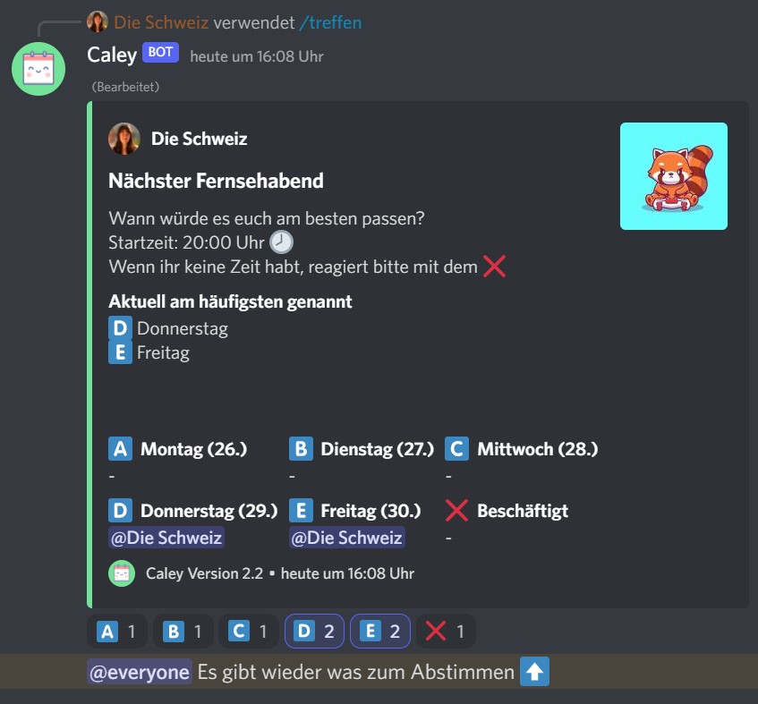
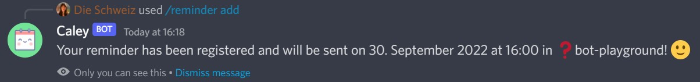
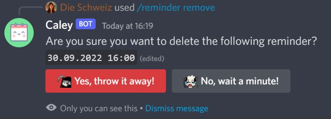

# Discord Bot Caley

Just my first try making a bot for Discord. You can roll a dice, let fate choose one of your provided options, set reminders at a specific date and time and create a poll to let people vote for your next day to meet. The bot now fully supports both German and English.

[➡️ Invite Caley here](https://discord.com/api/oauth2/authorize?client_id=802091512573722654&permissions=2148527168&scope=bot%20applications.commands)

## Usable commands

- `ping`
- `dice`
- `random`
- `reminder`
- `session`
- `vote`

## Gallery

## How to run your own Caley locally

1. `npm i`
1. `node deploy-commands.js`
1. `node .`

### Requires (.env)

- Discord Bot Token
- ID of the guild the dev-commands are used in
- ID of the bot
- AWS Key and AWS Secret Key
